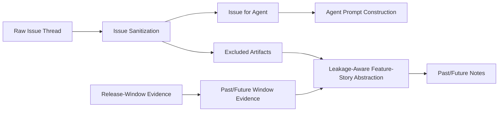

```mermaid
flowchart LR
    A[Raw Issue Thread] --> B[Issue Sanitization]
    B --> C[Issue for Agent]
    B --> D[Excluded Artifacts]

    E[Release-Window Evidence] --> F[Past/Future Window Evidence]
    D --> G[Leakage-Aware Feature-Story Abstraction]
    F --> G

    G --> H[Past/Future Notes]

    C --> I[Agent Prompt Construction]
```
